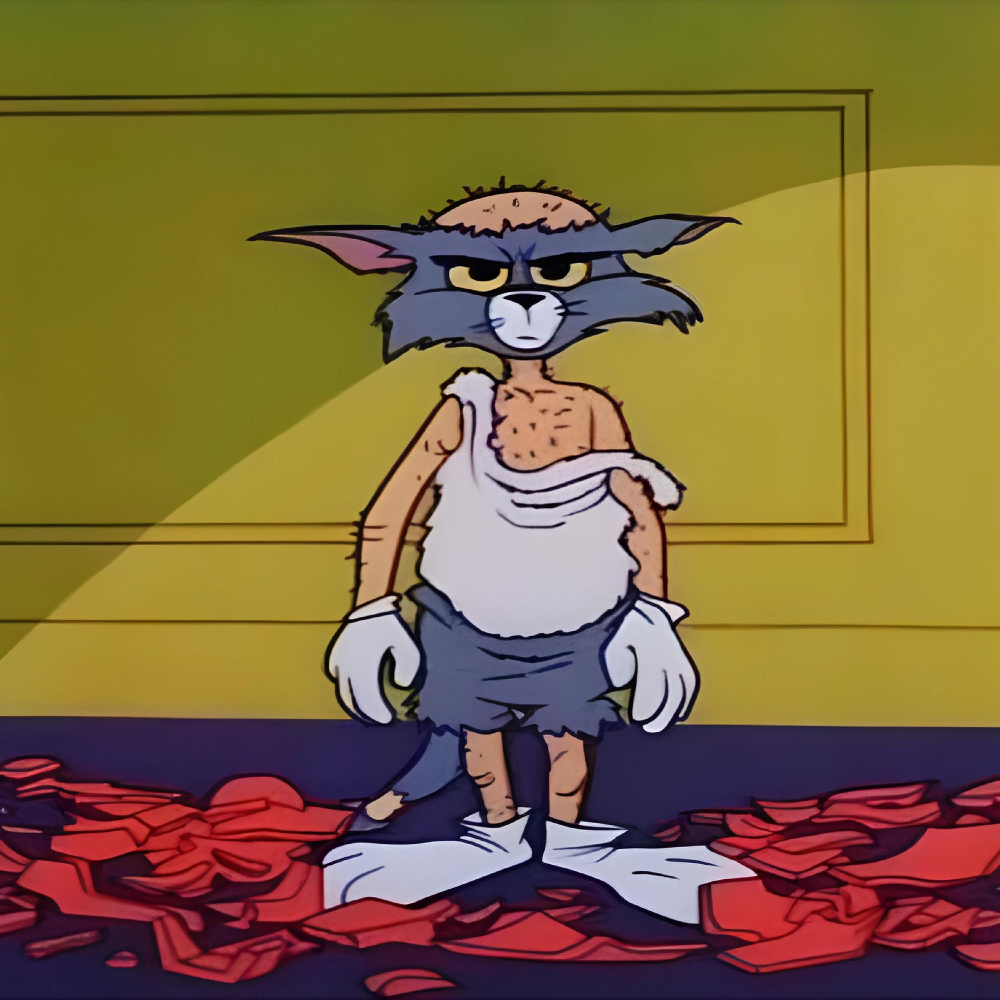

<h1 align="center">Hey, I'm Mohit!</h1>
<!-- <h3 align="center">A passionate CSE student from India</h3> -->

  

####

  

####

  

<h2 align="left">About Me:</h2>
- 🔭 I'm currently working on sharpening my skills 
- 🌱 I'm currently learning DSA 
- ⚡ I write occasionally

<h2 align="left">Languages and Tools:</h2>

  
  
  
  
  
  
  
  
  
  
  
  
  
  
  
  
  
  
  
  
  
  
  
  
  
  
  
  
  

###
  
  
  
  
  
  
  

<h2 align="left">IDE/Editor (s) In Use:</h2>

  
  
  
  
  

 

<h2 align="left">Stats:</h2>

  
  

####

 

